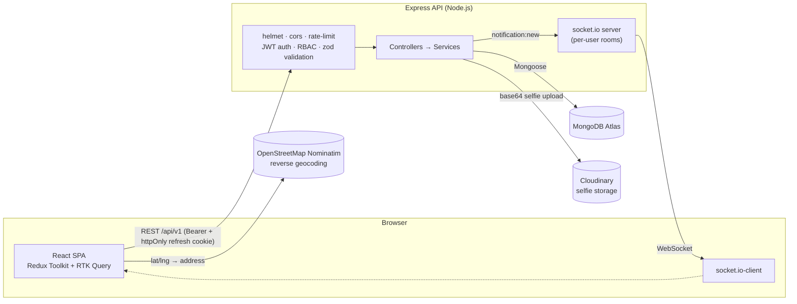

# Attendance Management System

A full-stack MERN application for tracking employee attendance via live selfie verification and geolocation, with role-based dashboards (Employee / Manager / Admin) and an overtime approval workflow.

## Tech Stack

- **Frontend**: React 18, Vite, Redux Toolkit + RTK Query, React Router v6, Tailwind CSS, react-hot-toast, recharts, date-fns, socket.io-client
- **Backend**: Node.js, Express.js, MongoDB + Mongoose, JWT (access + refresh), bcryptjs, zod, winston + morgan, helmet, cors, express-rate-limit, Cloudinary, exceljs, pdfkit, socket.io

## Project Structure

```
fullweb/
├── backend/     # Express API
└── frontend/    # React SPA
```

## Setup

### Prerequisites
- Node.js >= 18
- A MongoDB Atlas cluster (or local MongoDB instance)
- A Cloudinary account (for selfie storage)

### Backend
```bash
cd backend
npm install
cp .env.example .env   # fill in MONGO_URI, Cloudinary keys, JWT secrets
npm run dev
```

### Frontend
```bash
cd frontend
npm install
cp .env.example .env   # point VITE_API_BASE_URL at your backend
npm run dev
```

### Seed demo data
```bash
cd backend
npm run seed
```
This creates 1 admin, 2 managers, 6 employees, and 30 days of realistic attendance history. Credentials are printed to the console after seeding.

## Architecture Overview



**Request flow**: every API request passes through `helmet` → `cors` → (rate limiting on login) → `express.json` → `verifyJWT` (where required) → `authorize(...roles)` (where required) → `validate(zodSchema)` → controller → service → Mongoose model. Errors of any kind funnel into one central `error.middleware.js`, which normalizes `ApiError`, Mongoose `CastError`/`ValidationError`/duplicate-key, and `ZodError` into the same `{ success, message, errors }` envelope.

**Data scoping** (who can see what) is centralized in `scope.service.js` rather than duplicated per controller: `employee` → self only, `manager` → self + direct reports, `admin` → everything. Attendance, overtime, and reports all reuse the same three functions (`getScopedUserIds`, `getScopedUserFilter`, `canAccessUser`).

**Real-time layer**: Socket.IO authenticates each connection with the same JWT access token used for REST calls, then joins the socket to a room named after the user's ID. When an overtime request is reviewed or an attendance record is verified, the server emits `notification:new` directly to that room — no polling.

## Features Implemented

### Core (must-have)
- ✅ JWT auth (access + httpOnly refresh cookie) with automatic single-flight refresh-and-retry on 401
- ✅ Role-based access control — enforced in route middleware (`authorize(...roles)`) *and* in a shared data-scoping service, not just the frontend
- ✅ Protected routes on both frontend (`ProtectedRoute` / `RoleRoute`) and backend
- ✅ Punch in / punch out with live camera selfie (base64, no file upload) and geolocation capture, reverse-geocoded to a readable address
- ✅ All punch guard rails: no double punch-in (409), no punch-out without punch-in (400), no double punch-out (409)
- ✅ Automatic working-hours calculation and completed/incomplete/in-progress status, derived server-side from punch timestamps on every save
- ✅ Overtime request → manager/admin review workflow, restricted to the employee's actual assigned manager (or any admin)
- ✅ Employee, Manager, and Admin dashboards with stat cards and a working-hours chart
- ✅ Attendance validation: view selfies + location, mark valid/invalid, add remarks — scoped so a manager can only verify their own team
- ✅ Daily and date-range reports, scoped by role, with Excel and PDF export

### Good to have
- ✅ Filters (date range, work status, verification status, role, department, search) and pagination on every list
- ✅ Loading skeletons, empty states, and toast-driven error states throughout

### Bonus
- ✅ Geofencing — toggleable via `GEOFENCE_ENABLED`; punch in/out is rejected (403) outside `GEOFENCE_RADIUS_METERS` of the configured office coordinates
- ✅ Notifications — overtime approval/rejection and attendance verification results, delivered in real time via Socket.IO and visible in a bell dropdown with unread counts and mark-as-read
- ✅ Real-time updates — Socket.IO, JWT-authenticated per-user rooms
- ✅ Dark mode — Tailwind `class` strategy, persisted to `localStorage`, respects system preference on first load, no flash-of-wrong-theme
- ✅ Export reports — Excel (exceljs) and PDF (pdfkit)
- ⛔ Missed-punch alerts — **not implemented**. This needs a scheduled job (e.g. a daily cron checking who has no attendance record for the day) rather than an event triggered by a request, which is a different architectural piece than the rest of this bonus list. Given the 48-hour scope and the brief's own instruction to prioritize a well-structured partial solution over a rushed complete one, the notification *infrastructure* (model, delivery, real-time push) is fully built and this alert type is a small addition on top of it — just not one done here.

## Assumptions Made

- **Export reports (Excel/PDF)**: the assessment PDF lists this under "Bonus Features (Optional)," while the accompanying build spec schedules it as core Phase 5 work. Built as specified, but sequenced after the core attendance/RBAC/overtime flow so the mandatory 40%-weighted requirements are never put at risk by it.
- **Project root**: the build spec's folder tree nests everything under an `attendance-management-system/` wrapper directory. Since the working directory here is already a dedicated, empty project folder, `backend/` and `frontend/` live directly at its root instead of behind a redundant wrapper.
- **`manager` is not required at registration**: the data model spec says `manager` is required for employees, but `POST /auth/register` is public with no `manager` field. A new employee exists manager-less until an admin assigns one via the "Edit user" modal on `/admin/users`.
- **Missed-punch alerts** are out of scope for this build (see Bonus Features above) — they need a scheduled job, not a request-triggered handler.
- **Geofencing** defaults to disabled (`GEOFENCE_ENABLED=false`) so local development and the seeded demo data (real punch locations aren't near the configured office coordinates) work out of the box. Toggle it on to see it enforced.

## API Reference

Base URL: `/api/v1`. Every response follows `{ success, message, data, meta? }` on success or `{ success: false, message, errors: [] }` on error. See `backend/api.http` for runnable request samples with real payloads.

| Method | Route | Access | Notes |
|---|---|---|---|
| POST | `/auth/register` | public | role always forced to `employee` |
| POST | `/auth/login` | public | rate-limited; sets httpOnly refresh cookie |
| POST | `/auth/logout` | private | |
| POST | `/auth/refresh-token` | public | reads httpOnly cookie |
| GET | `/auth/me` | private | |
| PATCH | `/auth/update-profile` | private | |
| PATCH | `/auth/change-password` | private | |
| GET | `/users` | admin | filters: role, department, isActive, search; paginated |
| GET | `/users/team` | manager, admin | direct reports |
| GET | `/users/:id` | admin, manager (own team) | |
| PATCH | `/users/:id` | admin | role, department, manager, isActive |
| DELETE | `/users/:id` | admin | soft delete → `isActive: false` |
| POST | `/attendance/punch-in` | employee | body: selfie (base64), latitude, longitude |
| POST | `/attendance/punch-out` | employee | |
| GET | `/attendance/today` | private | |
| GET | `/attendance/my` | private | filters: startDate, endDate, workStatus; paginated |
| GET | `/attendance/team` | manager, admin | |
| GET | `/attendance/all` | admin | |
| GET | `/attendance/stats/summary` | private | scoped dashboard counts |
| GET | `/attendance/:id` | scoped | |
| PATCH | `/attendance/:id/verify` | manager (own team), admin | |
| POST | `/overtime` | employee | requires punch-out + hours > `STANDARD_SHIFT_HOURS` |
| GET | `/overtime/my` | employee | |
| GET | `/overtime/pending` | manager, admin | |
| GET | `/overtime/all` | admin | |
| PATCH | `/overtime/:id/review` | manager (own team), admin | |
| GET | `/reports/daily` | scoped | `?date=YYYY-MM-DD` |
| GET | `/reports/range` | scoped | `?startDate=&endDate=&userId=` |
| GET | `/reports/export/excel` | scoped | streams `.xlsx` |
| GET | `/reports/export/pdf` | scoped | streams `.pdf` |
| GET | `/notifications` | private | includes `unreadCount` |
| PATCH | `/notifications/:id/read` | private | |
| PATCH | `/notifications/read-all` | private | |
| GET | `/health` | public | |

## Demo Credentials

Run `npm run seed` from `backend/` to populate 1 admin, 2 managers, and 6 employees (3 per manager) with ~30 weekdays of realistic attendance each. All seeded accounts share one password.

| Role | Name | Email | Password |
|---|---|---|---|
| admin | Ava Admin | admin@attendance.test | `Passw0rd!123` |
| manager | Miles Manager | manager1@attendance.test | `Passw0rd!123` |
| manager | Maya Manager | manager2@attendance.test | `Passw0rd!123` |
| employee | Elena Employee | employee1@attendance.test | `Passw0rd!123` |
| employee | Ethan Employee | employee2@attendance.test | `Passw0rd!123` |
| employee | Ella Employee | employee3@attendance.test | `Passw0rd!123` |
| employee | Ezra Employee | employee4@attendance.test | `Passw0rd!123` |
| employee | Eve Employee | employee5@attendance.test | `Passw0rd!123` |
| employee | Emil Employee | employee6@attendance.test | `Passw0rd!123` |

Employees 1–3 report to Miles Manager; employees 4–6 report to Maya Manager. Seeded selfies use placeholder image URLs rather than real Cloudinary uploads, so `npm run seed` doesn't require live Cloudinary credentials.

**⚠️ `npm run seed` deletes all existing User/Attendance/Overtime data in whatever database `MONGO_URI` points to before repopulating.** Refuses to run when `NODE_ENV=production` unless passed `--force`.

## Live Links

_Not yet deployed. Fill in after deploying:_
- Frontend (Vercel): `<TBD>`
- Backend (Render): `<TBD>`

## Deployment Notes

- Camera and geolocation APIs require HTTPS in production (they work over plain HTTP only on `localhost`). Vercel and Render both provide HTTPS by default.
- Set `CORS_ORIGIN` on the backend host to the deployed frontend URL, and `VITE_API_BASE_URL` on the frontend host to the deployed backend URL (including `/api/v1`). Cookies use `sameSite: 'none'` + `secure: true` in production — this only works over HTTPS, which is why both hosts need real TLS, not just the browser page.
- Whitelist `0.0.0.0/0` in MongoDB Atlas network access if deploying the backend to Render (Render's outbound IPs aren't fixed on the free tier).
- Render's free tier cold-starts after ~15 minutes of inactivity — the first request after idle may take 30–60s. The Socket.IO connection will also drop and reconnect on cold start; the frontend's `NotificationBell` handles this automatically (`socket.io-client` reconnects on its own).
- **Render (backend)**: New Web Service → connect repo → root directory `backend` → build command `npm install` → start command `npm start` → add all `backend/.env.example` variables in the dashboard's environment settings (never commit real secrets).
- **Vercel (frontend)**: New Project → root directory `frontend` → framework preset Vite → add `VITE_API_BASE_URL` and `VITE_APP_NAME` in project environment variables → `frontend/vercel.json` already handles the SPA rewrite so client-side routes don't 404 on refresh.
- After both are live, run `npm run seed` **locally** against the production `MONGO_URI` once (or connect to the Atlas cluster directly) to populate demo accounts — don't run it from within the deployed Render instance, since that environment's `NODE_ENV=production` is intentionally guarded against accidental seeding.

## Pre-submission Checklist

- [ ] `backend/.env` filled in with a real `MONGO_URI` and real Cloudinary credentials (JWT secrets are already generated)
- [ ] `cd backend && npm install && npm run dev` — boots with no errors, `GET /api/v1/health` returns 200
- [ ] `cd frontend && npm install && npm run dev` — boots with no errors
- [ ] `npm run seed` run once against the target database; credentials table printed to console
- [ ] Manually walk through: register → login → punch in (camera + location) → punch out → request overtime → log in as manager → verify attendance → approve/reject overtime → log in as admin → edit a user's role/manager → export a report (Excel + PDF)
- [ ] Confirm RBAC: an employee token hitting `/api/v1/users` gets `403`
- [ ] `cd frontend && npm run build` succeeds with no errors
- [ ] Push to a public GitHub repository (`.env` files are gitignored — verify they weren't accidentally committed)
- [ ] Deploy backend to Render, frontend to Vercel; update `CORS_ORIGIN` and `VITE_API_BASE_URL` to point at each other; update the Live Links section above
- [ ] Re-test the deployed live links end-to-end, including camera/geolocation (requires HTTPS — see Deployment Notes)
